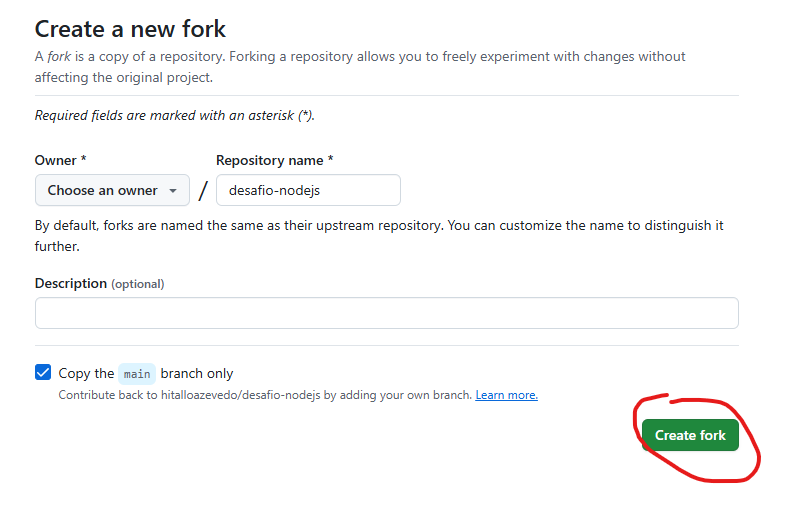

# desafio-nodejs

O Sr. Atira Silva Sauro enfrenta dificuldades para gerenciar suas tarefas diárias. Buscando uma solução na internet, ele encontrou a Atria, uma empresa especializada em desenvolvimento de software com foco em inovação. Após conversar com os consultores comerciais, decidiu investir em um projeto de um aplicativo para gerenciamento de tarefas. Como pretende utilizar a solução em múltiplos dispositivos, será desenvolvido também um sistema web para centralizar e sincronizar as informações.

Consulte a descrição do desafio em [requisitos do sistema](./instructions/description.md)

Consulte a estrutura do projeto em [estrutura do projeto](./instructions/project-arch.md)

Tecnologias e bibliotecas necessárias
- Node.js (versão 18 ou superior)
- Express.js

##### Rodando o projeto
Faça um fork do projeto para sua conta do Github.

  <h3>1º passo</h3>
  

  <h3>2º passo</h3>
  

Após criar sua própria cópia (fork), clone o projeto para o seu computador.

