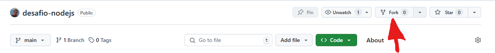

# desafio-nodejs

### Importante

Olá candidato(a),

Eu tenho um aviso SUPER importante para você, mas antes, meus parabéns pela sua iniciativa em querer participar da melhor empresa júnior do mundo (não espalhe esse segredo).

Antes que você se assuste com o case individual, eu preciso te explicar como irá funcionar.

Então, pegue um pipoca e aconchegue-se para ler este aviso, ou não, melhor prestar atenção aqui.

Se você é um bixo que nem sabe o que é programação ainda, ou um veterano que nunca aprendeu programação Web, não se preocupe.

Mas então como irá funcionar?

Um desafio técnico está sendo proposto, na verdade um baita desafio. Mas o que está sendo avaliado é outra coisa.

O entregável será um vídeo de até 5 minutos, <a href="#">roteiro para fazer o vídeo</a>. Além do vídeo com o seu relato, você irá entregar o código que foi desenvolvido por você. Mas e se eu não conseguir fazer a tempo? E se eu não aprender tudo o que precisa? E se meu código não funcionar? Depois nós vemos isso, como você já deve saber, para entrar na melhor empresa junior do mundo, você não precisa saber nada. Você irá aprender com a gente. Mas quem não gosta de um desafio?

Então se seu código não funcionar, seu mundo não irá acabar, apesar que eu e você ficaria bem feliz se funcionasse =)

Outros aspectos interpessoais serão avaliados, que vão além se sua API irá funcionar ou não, então o vídeo é muito importante, e a <strong>não entrega</strong> do vídeo resulta em desclassificação.

---

<a href="./instructions/desafio.md">Aceito este desafio!</a>

O Sr. Atira Silva Sauro enfrenta dificuldades para gerenciar suas tarefas diárias. Buscando uma solução na internet, ele encontrou a Atria, uma empresa especializada em desenvolvimento de software com foco em inovação. Após conversar com os consultores comerciais, decidiu investir em um projeto de um aplicativo para gerenciamento de tarefas. Como pretende utilizar a solução em múltiplos dispositivos, será desenvolvido também um sistema web para centralizar e sincronizar as informações.

Consulte a descrição do desafio em [requisitos do sistema](./instructions/description.md)

Consulte a estrutura do projeto em [estrutura do projeto](./instructions/project-arch.md)

#### O que você precisa instalar no seu computador? (Recomenda-se ter ~ 1.5GB de armazenamento livre)
- Node.js Javascript Runtime - [Baixar](https://nodejs.org/pt)
- GIT - [Baixar](https://git-scm.com/downloads)
- Visual Studio Code - [Baixar](https://code.visualstudio.com/)
- Postman - [Baixar](https://www.postman.com/downloads/)

### Guias básicos
#### [O que é git?](./instructions/git.md)
#### [O que é node?](./instructions/node.md)
#### [O que é express?](./instructions/express.md)
#### [O que é visual studio code?](./instructions/express.md)

### Como configurar o ambiente?
- criar conta no github
- fazer cópia do repositório (fork)
- clonar o repo localmente
- abrir o repositório e instalar as dependências
- iniciar o projeto

  <h3>1º passo</h3>
  

  <h3>2º passo</h3>
  

Após criar sua própria cópia (fork), clone o projeto para o seu computador.

